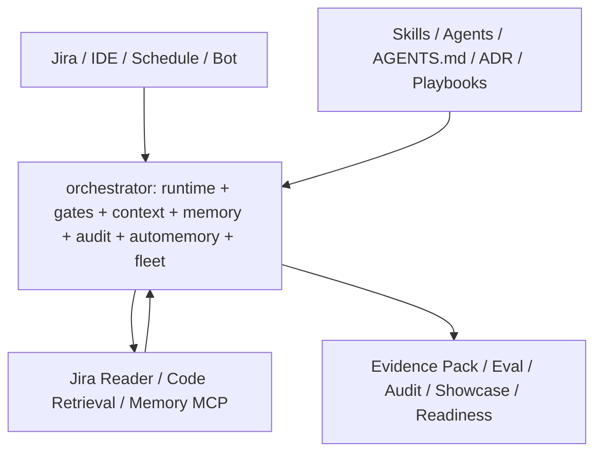

# Architecture Blueprint

Generated: 2026-05-16

## One-Line Architecture

Copilot-Harness uses Copilot SDK/CLI as the execution shell, OpenCode-derived Skill/Memory/MCP
assets as the cognitive layer, and a TypeScript orchestrator as the governance and audit control
plane.

## Logical Shape



## Repository Module Map

| Module                        | Role                                 | Current Boundary                                                                                                   |
| ----------------------------- | ------------------------------------ | ------------------------------------------------------------------------------------------------------------------ |
| `orchestrator/`               | TypeScript control plane             | Runtime abstraction, gates, context, memory client/store, audit, Auto-Memory, Fleet/Arena, eval, smoke, CI policy. |
| `mcp-servers/jira-reader/`    | Read-only Jira MCP                   | `getIssue`, `searchIssues`, `getComments`; no write tools.                                                         |
| `mcp-servers/code-retrieval/` | Read-only GitLab/local code evidence | Search/read/tree/MR/commit/diff/pipeline evidence with stable source refs.                                         |
| `mcp-servers/memory/`         | Shared Memory MCP                    | Portable record, producer identity, optimistic locks, WAL, redline rules.                                          |
| `skills/`                     | Skill assets                         | Jira analysis, Angular delivery/regression, blood-transfusion, templates.                                          |
| `playbooks/`                  | Workflow assets                      | Currently mostly placeholder/source for W17 shadow artifacts.                                                      |
| `apps/showcase/`              | Read-only Vue governance UI          | Static/current snapshot driven; not source of truth.                                                               |
| `docs/`                       | Decisions and evidence               | ADRs, phase contracts, closure reports, framework synthesis.                                                       |
| `reports/` and `state/tasks/` | Runtime evidence artifacts           | Shadow/readiness/eval output; not design source.                                                                   |

## Orchestrator Responsibilities

| Layer        | Responsibility                                                                                                  |
| ------------ | --------------------------------------------------------------------------------------------------------------- |
| Runtime      | Isolate upper layers from Copilot SDK/CLI differences; lock model; surface unsupported capabilities explicitly. |
| Gates        | Enforce budget, policy allowlists, validator schema, and audit semantics.                                       |
| Context      | Assemble Jira, GitLab/code retrieval, Memory hot_index, and Skill hints under budget.                           |
| Memory       | Store/retrieve portable decisions, knowledge, aliases, and hot index records.                                   |
| Auto-Memory  | Extract candidates, route to pending review, and preserve audit chain.                                          |
| Fleet/Arena  | Compare candidate outputs in mock/shadow paths before real fanout is allowed.                                   |
| Eval/Reports | Produce regression and readiness evidence that can be compared over time.                                       |

## Control Gates

| Gate       | What It Protects                                          | Current State                                                     |
| ---------- | --------------------------------------------------------- | ----------------------------------------------------------------- |
| BudgetGate | Fanout, tool calls, token/premium request budget          | Implemented; W9 forced overrun evidence exists.                   |
| PolicyGate | Tool allowlist, write intent, high-risk actions           | Implemented; W16 default deny evidence exists.                    |
| Validator  | Turn state, Evidence Pack, source refs, confidence ranges | Implemented across runtime/context tests and reports.             |
| Audit      | Traceable decision and tool-call chain                    | JSONL/report artifacts exist; OTel-compatible direction captured. |

## Evidence And Context

Evidence Pack is the framework's smallest unit of trust. It should carry:

- `task_id`
- `intent`
- `evidences[]` with `source_ref`, `content`, and `tool`
- `assumptions[]`
- `confidence`

Jira-only analysis is not sufficient for code planning. The adopted resolver direction is:

`Jira Context Pack -> GitLab Query Plan -> GitLab Evidence Pack -> Draft Plan`

If code evidence is missing, the system must return `need_more_context`, `await_human`, or
`blocked`, not a fabricated repo/module/file conclusion.

## Business Enhancement Layer

The adopted business-enhancement baseline separates technical execution from business cognition:

| Layer              | Responsibility                                                                                                              |
| ------------------ | --------------------------------------------------------------------------------------------------------------------------- |
| Business Skills    | Explain domain concepts, parse rules, trace flows, run impact analysis, decompose tasks, and produce validation checklists. |
| External knowledge | Keeps long-form business documents, rules, flow diagrams, data dictionaries, and meeting/source documents outside code.     |
| MCP/Adapter facts  | Fetch Jira, GitLab, Notion/Confluence, DB schema, SSO/CA, logs, and runtime evidence under policy.                          |
| Lightweight Memory | Stores stable indexes, topology, decisions, aliases, and preferences, not raw business documents.                           |

This is why the current architecture emphasizes source refs and controlled context assembly instead
of loading full business documents into prompts or long-term Memory.

## Memory Architecture

Memory is not a dumping ground for large business text. It stores stable, lightweight records:

- decisions
- knowledge index
- aliases
- topology-like hints
- portable cross-client records

W13 defines the portable record boundary:

```ts
interface MemoryPortableRecordV1 {
  kind: "decision" | "knowledge" | "alias";
  key: string;
  value: string;
  source_ref: string;
  producer_agent: string;
  ts: string;
  confidence: number;
}
```

Production single-write cutover is blocked until real two-day dual-write drift evidence exists.

## Frontend Boundary

The Showcase is a read-only governance and demonstration surface:

- It may display Jira queues, evidence, gates, tasks, Agent progress, and audit signals.
- It must not become source of truth.
- It must not directly execute write actions.
- Configuration center and progress details are documented as product requirements, not yet backend-secure implementation.

## Current Architectural Posture

The framework is currently strongest in:

- Contracts.
- Local gates.
- Read-only evidence assembly.
- Mock/shadow control-plane proofs.
- Readiness/no-go packaging.

It is intentionally not yet opened for:

- Real production write-back.
- Real multi-agent worktree fanout.
- Automatic GitLab MR creation.
- Jira status changes.
- Memory MCP single-write cutover.
