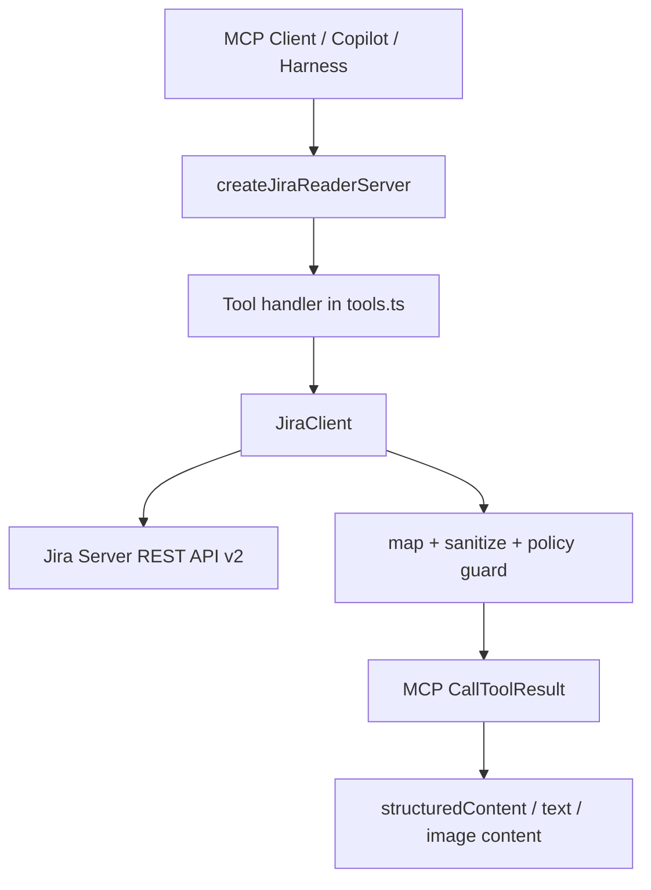

# Jira Reader MCP 当前实现说明

更新时间：2026-05-18

## 结论摘要

`jira-reader` 是当前框架中面向 Jira Server 7.10.1 REST API v2 的只读 MCP Server。它不是完整 Jira API 网关，而是在 Jira REST API 之上做了面向 AI 需求理解场景的安全二次封装。

当前 MCP 已从最初的 `getIssue`、`searchIssues`、`getComments` 扩展为 12 个只读工具，覆盖 issue 读取、JQL 搜索、评论、实例信息、字段元数据、附件元数据、附件图片内容、issue 扩展信息、项目元数据、关联关系和可流转动作。

核心设计原则：

- 只读默认：所有 MCP tools 都标记为 `readOnlyHint: true`、`destructiveHint: false`。
- 项目边界：`JIRA_PROJECT_ALLOWLIST` 可限制 issue key、JQL project、project metadata 查询范围。
- 字段白名单：issue 查询只请求明确允许的字段，避免把 reporter、账号、隐私字段原样交给模型。
- 输出脱敏：文本输出统一脱敏 email、内网 IP、token、secret、账号密码类内容。
- 附件安全：附件内容读取必须先证明 attachment 属于当前 issue；附件 URL 必须与 `JIRA_BASE_URL` 同源；图片以 MCP `image` content 返回，base64 不重复写入 JSON 文本。

## 当前能力清单

| Tool | 作用 | Jira REST API | 典型用途 |
| --- | --- | --- | --- |
| `getIssue` | 获取单个 issue 的白名单字段 | `GET /rest/api/2/issue/{issueIdOrKey}` | 构建基础需求上下文 |
| `searchIssues` | 限制 JQL 搜索 issue | `GET /rest/api/2/search` | 批量发现需求、回归关联问题 |
| `getComments` | 获取 issue 评论 | `GET /rest/api/2/issue/{issueIdOrKey}/comment` | 补充讨论、验收口径、测试反馈 |
| `getServerInfo` | 获取 Jira 实例信息 | `GET /rest/api/2/serverInfo` | 识别 Server/版本/API 兼容性 |
| `getAttachmentMeta` | 获取附件开关和上传上限 | `GET /rest/api/2/attachment/meta` | 判断附件能力是否可用 |
| `getFields` | 获取字段元数据 | `GET /rest/api/2/field` | 将 `customfield_xxx` 映射为业务字段名 |
| `getIssueDetails` | 获取 issue names/schema/rendered/changelog | `GET /rest/api/2/issue/{key}?expand=...` | 提升字段可解释性和变更历史理解 |
| `getIssueAttachment` | 获取 issue 附件元数据 | `GET /issue` + `GET /attachment/{id}` | 安全确认附件归属和图片属性 |
| `getIssueAttachmentContent` | 获取 issue 图片附件内容 | `GET /attachment/{id}` + secure content URL | 将 Jira 截图传给支持 image content 的 MCP 客户端 |
| `getProjectMetadata` | 获取项目、模块、版本、状态 | `GET /project/{key}` 等 | 生成 PRD/任务计划时补足模块和版本语义 |
| `getIssueRelations` | 获取父子任务、issue links、remote links | `GET /issue` + `GET /remotelink` | 理解上下游依赖和关联代码/MR |
| `getTransitions` | 获取当前可用流转动作 | `GET /issue/{key}/transitions` | 判断 issue 当前可执行工作流状态 |

## 核心工作流



对于 `APMIS-2234` 这类登录页样式缺陷，文字描述只能说明“样式与原系统不一致”，真正的需求证据在截图附件中。新增 `getIssueAttachmentContent` 后，MCP 可以把截图作为 MCP image content 交给支持多模态内容的客户端，用于识别输入框宽度、按钮尺寸、布局差异等视觉验收点。

## 代码文件清单

### MCP 包源代码

| 文件 | 作用 |
| --- | --- |
| `mcp-servers/jira-reader/package.json` | 包定义、bin 入口、依赖和脚本。包名为 `@copilot-harness/jira-reader-mcp`，bin 为 `jira-reader-mcp`。 |
| `mcp-servers/jira-reader/src/index.ts` | stdio server 启动入口；导出 `JiraClient`、MCP server factory、schema、types。 |
| `mcp-servers/jira-reader/src/config.ts` | 从环境变量读取 `JIRA_BASE_URL`、`JIRA_USERNAME`、`JIRA_API_TOKEN`、`JIRA_PROJECT_ALLOWLIST`。 |
| `mcp-servers/jira-reader/src/tools.ts` | MCP tool 注册、Zod input schema、tool handler、MCP result 格式化。 |
| `mcp-servers/jira-reader/src/jiraClient.ts` | Jira REST API 调用、超时、认证、响应 mapper、附件二进制读取。 |
| `mcp-servers/jira-reader/src/security.ts` | 字段白名单、JQL 限制、project allowlist、脱敏、附件大小限制。 |
| `mcp-servers/jira-reader/src/types.ts` | Jira issue、comment、attachment、field、project、relation、transition 等结构化类型。 |
| `mcp-servers/jira-reader/src/errors.ts` | `JiraConfigError`、`JiraPolicyError`、`JiraRequestError` 和 MCP 错误映射。 |
| `mcp-servers/jira-reader/src/mockJiraServer.ts` | 测试用 mock Jira Server，实现 issue/search/comment/field/attachment/project/relations/transitions 等端点。 |

### MCP 包测试和配置

| 文件 | 作用 |
| --- | --- |
| `mcp-servers/jira-reader/test/mcpTools.test.ts` | MCP in-memory transport 测试；覆盖工具列表、基础读取、新增 metadata、附件 image content、项目元数据、关系和 transitions。 |
| `mcp-servers/jira-reader/test/mockJiraServer.ts` | 历史测试 mock 入口；当前核心 mock 实现在 `src/mockJiraServer.ts`。 |
| `mcp-servers/jira-reader/README.md` | MCP 包说明、工具表、安全边界、本地命令、Copilot 配置示例。 |
| `mcp-servers/jira-reader/tsconfig.json` | TypeScript 开发类型检查配置。 |
| `mcp-servers/jira-reader/tsconfig.build.json` | 构建到 `dist/` 的配置。 |
| `mcp-servers/jira-reader/eslint.config.js` | ESLint 配置。 |
| `mcp-servers/jira-reader/vitest.config.ts` | Vitest 配置。 |
| `mcp-servers/jira-reader/.prettierignore` | Prettier 忽略规则。 |

### 上层消费方代码

| 文件 | 与 Jira MCP 的关系 |
| --- | --- |
| `orchestrator/src/smoke.ts` | 通过 `createJiraReaderServer` 和 `JiraClient` 做 smoke 测试，验证 MCP round-trip。 |
| `orchestrator/src/jira/context.ts` | 将 `JiraIssue`、`JiraComment` 转换为 `JiraContextPackV1`，生成 Jira 分析 prompt 和 Jira-GitLab 两阶段分析 prompt。当前仍主要消费文本和附件元数据。 |
| `orchestrator/src/jira/context.test.ts` | 使用 `startMockJiraServer` 和 `JiraClient` 验证 context pack、attachment metadata、prompt 构建。 |
| `orchestrator/src/jira/goldenFixtures.ts` | Jira context pack 的 golden fixture。 |
| `orchestrator/src/jira/goldenFixtures.test.ts` | 验证 Jira prompt golden 输出。 |
| `orchestrator/src/jira/gitlabEvidenceFixtures.ts` | Jira-GitLab evidence prompt 测试数据。 |
| `scripts/w2-jira-verify.ts` | 真实 Jira 验证脚本，直接调用 `JiraClient` 并通过 MCP in-memory transport 验证工具行为。 |
| `scripts/run-jira-reader-live-verify.sh` | 真实 Jira 验证 shell 入口。 |
| `scripts/showcase-evidence-closure.ts` | 用 Jira MCP 采集 showcase evidence pack 和 trace。 |
| `scripts/w8-generate-mapping-draft.ts` | 用 Jira issue 信号生成项目/模块映射草案。 |
| `scripts/showcase-export-lib.ts` | 将任务状态和 evidence pack 中的 Jira issue 输出到 showcase 数据模型。 |
| `apps/showcase/src/types.ts` | Showcase Jira issue 类型定义。 |
| `apps/showcase/src/App.vue` | 展示 Jira issue、Jira MCP trace、任务状态和跳转入口。 |

### 相关文档和证据文件

| 文件 | 作用 |
| --- | --- |
| `docs/adr/0002-w2a-runtime-and-mcp-ownership.md` | 记录 runtime 与 MCP ownership 的架构决策。 |
| `docs/w2-acceptance-report-template.md` | W2 Jira Reader 验收模板。 |
| `docs/project-brief-architecture-progress.md` | 项目架构进展中记录 Jira Reader MCP 状态。 |
| `docs/framework/03-architecture-blueprint.md` | 框架蓝图中记录 Jira Reader MCP。 |
| `docs/framework/05-implementation-artifacts.md` | 实现制品清单中记录 Jira Reader MCP。 |
| `orchestrator/docs/mcp-trace-demo.jsonl` | Jira MCP trace 示例。 |
| `orchestrator/docs/showcase/w4-acceptance-report.md` | Showcase 接受报告中引用 Jira Reader trace。 |
| `state/tasks/showcase/w4-evidence-jira-reader-live.json` | Jira Reader live evidence state。 |
| `state/tasks/showcase/w4-evidence-jira-reader-mock.json` | Jira Reader mock evidence state。 |
| `reports/mcp-traces/**/jira-reader-trace.jsonl` | Jira Reader MCP 调用 trace。 |

`dist/`、`node_modules/` 和 generated snapshot 属于构建或展示产物，不作为源代码维护入口。

## 安全边界

### 只读工具边界

`tools.ts` 中注册的所有工具都使用只读 MCP annotations：

- `readOnlyHint: true`
- `destructiveHint: false`
- `idempotentHint: true`
- `openWorldHint: true`

当前没有封装 create issue、edit issue、transition issue、add comment、delete attachment 等写操作。若后续要加入写能力，应单独建立 `jira-writer` 或在工具级增加强制审批、审计和 dry-run。

### JQL 和项目边界

`searchIssues` 的 JQL 限制：

- 长度 1 到 512。
- 禁止控制字符、`;`、SQL/Jira 写操作关键词、`issueFunction` 等危险语法。
- 如果设置 `JIRA_PROJECT_ALLOWLIST`，JQL 必须包含显式 project 过滤，并且 project 必须在 allowlist 内。

### 附件边界

`getIssueAttachmentContent` 的防护：

- `attachmentId` 必须是数字。
- 先通过 `getIssue(issueKey)` 查 issue 附件列表，确认 attachment 属于该 issue。
- 再调用 `GET /rest/api/2/attachment/{id}` 获取真实 content URL。
- content URL 必须与 `JIRA_BASE_URL` 同源。
- 下载使用 `Range` header，默认 2MiB，最大 5MiB。
- `structuredContent` 只返回 metadata；图片 bytes 只作为 MCP `image` content 返回。

## 当前限制

1. `orchestrator/src/jira/context.ts` 当前仍是文本上下文模型，只保留附件 `filename/mimeType/size/sourceRef`，尚未消费 MCP image content。
2. `runtime` 层当前主要发送 string prompt；如果希望 harness 自动把 Jira 截图传给多模态模型，需要扩展 runtime adapter 的 content item 结构。
3. 评论中的图片解析尚未实现。Jira Server 备注通常可能出现 wiki image markup 或 HTML/renderer 输出，需要单独解析 comment body/rendered body。
4. 当前未开放写操作，因此不能自动回写 Jira 评论、流转状态或附件。
5. `getFields` 已能获取字段元数据，但 custom field 到业务字段的长期映射仍应有缓存或配置层，避免每次运行都靠模型推断。

## Copilot / VS Code 接入

该 MCP 是 stdio server，可配置到支持 MCP 的 GitHub Copilot / VS Code Agent 模式。

示例 `.vscode/mcp.json`：

```json
{
  "servers": {
    "jira-reader": {
      "type": "stdio",
      "command": "node",
      "args": ["mcp-servers/jira-reader/dist/index.js"],
      "env": {
        "JIRA_BASE_URL": "http://jira.internal.example",
        "JIRA_PROJECT_ALLOWLIST": "APMIS"
      }
    }
  }
}
```

注意：

- 先运行 `pnpm --filter @copilot-harness/jira-reader-mcp build`。
- 不要把真实 Jira 凭据写入仓库级 `.vscode/mcp.json`。
- `JIRA_USERNAME` 与 `JIRA_API_TOKEN` 应放在用户级 MCP 配置、系统环境变量或 secret manager 中。
- Copilot 客户端是否能利用 `getIssueAttachmentContent` 的图片能力，取决于该客户端对 MCP image content 的支持程度。

## 验证命令

```sh
pnpm --filter @copilot-harness/jira-reader-mcp typecheck
pnpm --filter @copilot-harness/jira-reader-mcp test
pnpm --filter @copilot-harness/jira-reader-mcp lint
pnpm --filter @copilot-harness/jira-reader-mcp format:check
pnpm --filter @copilot-harness/jira-reader-mcp build
```

本次扩展后，上述命令均已通过。

## 后续建议

1. 在 orchestrator 中新增 `JiraMediaEvidenceV1`，把 `getIssueAttachmentContent` 的图片分析结果转为 `visual_summary`、`ocr_text`、`acceptance_clues`。
2. 增加 comment image parser，识别 Jira Server wiki image markup 和 rendered HTML 中的附件引用。
3. 为 `getFields` 结果建立字段缓存和 custom field mapping 文档，减少模型上下文开销。
4. 保持写操作隔离，不要把 Jira 管理类 API 全量暴露给 AI。
5. 在 Copilot MCP 配置中使用最小 project allowlist，避免跨项目数据泄露。
