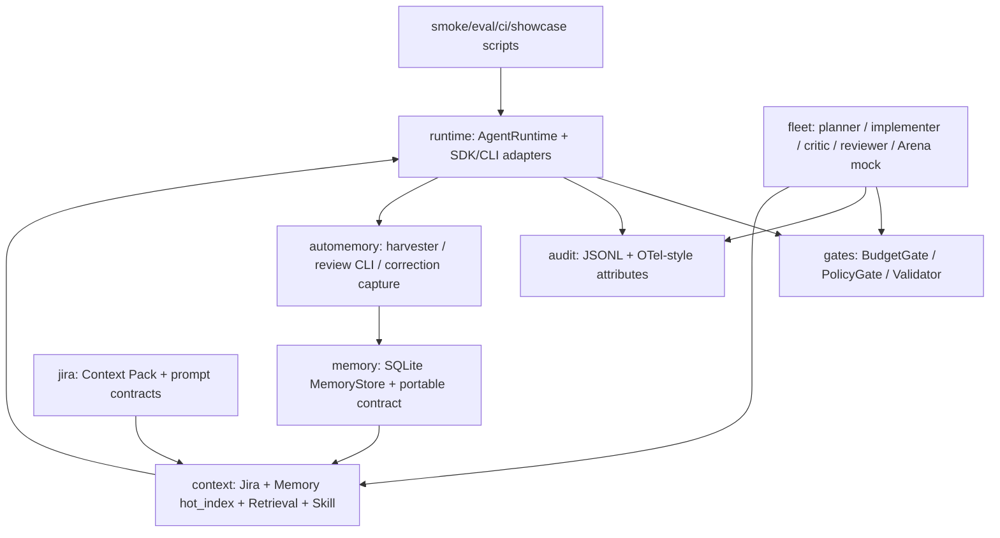

# Orchestrator 当前落地实现说明

生成日期：2026-05-15
范围：本文只整理 `orchestrator/` 在当前工程中的真实落地，不复述完整路线图。代码证据来自 `orchestrator/src/**`、相关脚本和阶段报告。

## 1. 当前结论

Orchestrator 已经从 W1 的 skeleton 演进为一套“控制面优先”的 TypeScript 编排实现。它目前能稳定支撑：

- SDK / CLI 双 Runtime 的统一接口与能力探测。
- 单模型 `gpt-5-mini` 锁定、`reasoningEffort` 一等字段和审计输出。
- Budget / Policy / Validator 三类 gate 的本地判断与 partial-result 降级。
- Jira Context Pack、Memory hot_index、GitLab Retrieval、Skill hint 的上下文装配。
- Auto-Memory Harvester、Review CLI、Correction Capture 的候选提取与人工审批链路。
- W10/W12 多 Agent / Arena 的 deterministic mock 控制面。
- W8/W11/W13 等评估、CI policy、showcase snapshot 的数据出口。

它暂时还没有完成生产侧真实闭环：

- 真实 `/fleet` worktree fanout 仍关闭。
- 真实 GitLab MR 创建、push、merge 均关闭。
- GitLab Runner 不可用导致 W11 live CI job 未完成执行。
- W13 Memory 仅有 mock drift 证据，未完成真实 2 天 dual-write cutover。

## 2. 实现层次



## 3. 目录与职责

| 目录              | 当前职责                                                                  | 代表文件                                                                                 |
| ----------------- | ------------------------------------------------------------------------- | ---------------------------------------------------------------------------------------- |
| `src/runtime/`    | Runtime 合同、SDK/CLI adapter、Skill/Agent loader、bootstrapping          | `types.ts`、`copilotSdkRuntime.ts`、`copilotCliRuntime.ts`、`adapters/*`、`bootstrap.ts` |
| `src/gates/`      | BudgetGate、PolicyGate、Validator、本地配置和预算超限 partial result      | `index.ts`、`budgetPressure.ts`                                                          |
| `src/context/`    | 上下文片段、Memory hot_index 注入、GitLab retrieval budget、prompt 渲染   | `index.ts`                                                                               |
| `src/memory/`     | Orchestrator 内 MemoryStore，SQLite、portable record、conflict、hot_index | `index.ts`                                                                               |
| `src/audit/`      | turn 级 JSONL 审计与 OTel GenAI 属性映射                                  | `index.ts`、`types.ts`                                                                   |
| `src/automemory/` | Harvester、Review CLI、Correction Capture、review metrics                 | `harvester.ts`、`reviewCli.ts`、`correctionCapture.ts`                                   |
| `src/fleet/`      | W10/W12 多 agent mock 控制面、Arena scoring/archive                       | `coordinator.ts`、`arenaScorer.ts`、`arenaStore.ts`                                      |
| `src/jira/`       | Jira Context Pack、Jira + GitLab 两段式分析 prompt 与输出校验             | `context.ts`                                                                             |
| `src/ci/`         | 本地 CI policy gate 与格式检查                                            | `policyCheck.ts`、`formatCheck.ts`                                                       |
| `src/eval*.ts`    | W3/W8/Harvester 等评估报告生成                                            | `eval.ts`、`w8Eval.ts`、`automemory/evalHarvester.ts`                                    |

## 4. Runtime 层：统一壳 + 单模型约束

Runtime 的核心价值是把业务层与 Copilot SDK / CLI 的变化隔离开。所有上层结果都统一成 `AgentResult`，包含 model、runtime、reasoning effort、EvidencePack、auditTraceId、capability flags、tool calls、token usage。

当前类型层面把模型锁死为 `gpt-5-mini`，这不是注释约束，而是 TypeScript union：

```ts
// orchestrator/src/runtime/types.ts
export type RuntimeModel = "gpt-5-mini";
export type ReasoningEffort = "minimal" | "low" | "medium" | "high";
export const DEFAULT_MODEL: RuntimeModel = "gpt-5-mini";

export interface AgentRuntime {
  run(task: AgentTask): Promise<AgentResult>;
  spawn(count: number): Promise<readonly AgentResult[]>;
  onTurnEnd(hook: TurnEndHook): void;
  onToolCall(hook: ToolCallHook): void;
  resumeSession(sessionId: string): Promise<AgentResult>;
}
```

Runtime bootstrapping 负责选择 SDK/CLI adapter，并默认安装 Auto-Memory Harvester hook：

```ts
// orchestrator/src/runtime/bootstrap.ts
export function createBootstrappedRuntime(
  input: RuntimeBootstrapInput,
): CopilotSdkRuntime | CopilotCliRuntime {
  const runtime =
    input.runtime === "sdk"
      ? new CopilotSdkRuntime({
          adapter: input.adapter ?? new CopilotSdkAdapter(adapterOptions),
          ...(input.auditLogger !== undefined
            ? { auditLogger: input.auditLogger }
            : {}),
        })
      : new CopilotCliRuntime({
          adapter: input.adapter ?? new CopilotCliAdapter(adapterOptions),
          ...(input.auditLogger !== undefined
            ? { auditLogger: input.auditLogger }
            : {}),
        });

  if (input.autoMemory?.enabled ?? true) {
    installAutoMemoryHarvester(runtime, input.autoMemory?.options);
  }

  return runtime;
}
```

SDK adapter 目前有两种执行形态：

- `allowExternalExecution !== true`：走 contract run，不真正调用外部 Copilot。
- `allowExternalExecution === true`：创建 Copilot SDK session，加载 Skill / custom agent，并发送 prompt。

这段逻辑是当前“mock/control-plane 与 live 执行”的关键分界：

```ts
// orchestrator/src/runtime/adapters/copilotSdkAdapter.ts
if (!probe.capabilities.externalExecution) {
  const output = `SDK adapter contract run for ${request.taskId} using ${request.model} with reasoningEffort=${request.reasoningEffort}.`;
  return {
    output,
    toolCalls: [],
    inputTokens: estimateTokens(request.prompt),
    outputTokens: estimateTokens(output),
    capabilityNotes: probe.capabilities.unsupportedReasons,
  };
}

const session = await client.createSession({
  ...sessionConfig,
  customAgents: [...sessionConfig.customAgents],
  onPermissionRequest: sdk.approveAll,
});
const message = await session.sendAndWait(
  { prompt: request.prompt },
  request.timeoutMs,
);
```

当前 SDK/CLI Runtime 的 `spawn()` 和 `resumeSession()` 都返回结构化 unsupported capability，不会假装支持：

- SDK spawn：`W9 AgentRuntimeV1 keeps real fanout disabled...`
- CLI spawn：同样 blocked。
- resumeSession：等待 ADR 补充 audited resume adapter contract。

## 5. Skill / Agent Loader：把业务资产接入 Runtime

`skillAgentLoader.ts` 负责把仓库内的 `AGENTS.md`、investigator agent 和 Skills 变成 SDK session config。

当前内置 agent 是 `investigator`，允许工具只有 Jira Reader 三个只读工具：

```ts
export const INVESTIGATOR_AGENT_NAME = "investigator";
export const INVESTIGATOR_SKILL_NAME = "jira-requirement-analysis";
export const BLOOD_TRANSFUSION_SKILL_NAME = "blood-transfusion";
export const INVESTIGATOR_ALLOWED_TOOLS = [
  "getIssue",
  "searchIssues",
  "getComments",
] as const;
```

动态 Skill 选择目前有一个已落地示例：任务描述命中输血相关触发词时，自动追加 `blood-transfusion` Skill。这个实现证明 Orchestrator 已经不是简单拼 prompt，而是可以按任务语义选择业务资产。

## 6. Gates：预算、策略、验证三层防护

Gate 层目前集中在 `src/gates/index.ts`。默认预算阈值：

```ts
export const DEFAULT_GATES_CONFIG: GatesConfig = {
  maxFanout: 4,
  maxFleetFanout: 5,
  maxToolCalls: 8,
  maxInputTokens: 10_000,
  maxOutputTokens: 4_000,
  maxPremiumRequests: 1,
};
```

PolicyGate 的只读工具白名单已经覆盖 Jira Reader 与 Code Retrieval：

```ts
const ALLOWED_READ_ONLY_TOOLS = new Set([
  "getIssue",
  "searchIssues",
  "getComments",
  "searchCode",
  "readFile",
  "listRepositoryTree",
  "listMergeRequests",
  "listCommits",
  "getDiff",
  "listPipelines",
]);
```

BudgetGate 超限不是抛普通错误后中断，而是转换为可审计、可展示的 blocked partial result：

```ts
export function toBudgetOverrunPartialResultV1(
  error: BudgetExceededError,
  partialResult: BudgetPartialResultV1 = {
    summary: "BudgetGate denied execution before additional work could start.",
    completed_steps: ["budget_gate_evaluated"],
    blocked_reason: error.message,
  },
): BudgetOverrunPartialResultV1 {
  return {
    schema_version: "phase-1c-w9-budget-overrun-partial-result@1",
    task_id: error.taskId,
    turn_state: "blocked",
    policy_decision: "deny",
    exceeded_budget: error.exceededBudget,
    budget_usage: error.budgetUsage,
    budget_limit: error.budgetLimit,
    partial_result: partialResult,
    audit_trace_id: error.traceId ?? `${error.taskId}-budget-overrun`,
    recovery_hint: error.recoveryHint,
  };
}
```

Validator 主要守住两类东西：

- `turn_state` 必须在五态内。
- EvidencePack 必须有至少一条带 `source_ref` 的 evidence，confidence / assumption confidence 必须在 0..1。

## 7. Context：Jira + Memory + GitLab evidence + Skill

Context Assembler 已经落到“结构化片段 + 预算控制”的实现，不是纯字符串拼接。核心类是 `MemoryBackedContextAssembler`。

Jira + GitLab 联合分析装配顺序如下：

```ts
// orchestrator/src/context/index.ts
return {
  fragments: [
    ...request.jiraFragments,
    ...memoryFragments,
    ...retrievalResult.fragments,
    ...skillFragments,
  ],
  redactionApplied:
    hotIndex.warnings.length > 0 ||
    retrievalResult.redactionApplied ||
    request.retrievalFragments.some((fragment) => fragment.redacted === true),
  memory_hit_count: memoryFragments.length,
  retrieval_hit_count: retrievalResult.fragments.length,
  skill_hint_count: skillFragments.length,
  memory_loading_strategy: "hot_index_then_lazy_search",
  retrieval_budget_summary: retrievalResult.budgetSummary,
};
```

代表性落点：

- Memory 默认注入 `hotIndex()`，`maxSummaryBytes=240`。
- Retrieval 默认 `maxBytesPerFragment=8192`、`maxTotalBytes=24576`。
- `reports/`、`.memory/`、`secrets/`、`.env*`、`node_modules/`、`dist/`、`coverage/` 会被 context retrieval 排除。
- 超预算内容会被 UTF-8 安全截断并标记 `[truncated]`。

## 8. Jira Context 与两段式分析

`src/jira/context.ts` 已落地 Jira Context Pack v1：

- issue key、summary、description、status、priority、assignee、labels、project。
- comments 与 attachments metadata。
- 每个字段带 sourceRef。

同一文件还定义了 Jira + GitLab 两段式分析：

1. `jira_to_gitlab_query_plan`：从 Jira context 生成 GitLab 查询计划。
2. `jira_gitlab_evidence_to_plan`：把 GitLab evidence 转成 repo hints 与 plan。

输出校验包含：

- gitlab query 最多 5 条。
- `next_action=run_gitlab_queries` 时必须有 query。
- repo hint、evidence、plan 等输出必须满足固定结构。

这对应 W8 的“需求理解必须绑定 GitLab evidence，不允许编造模块”。

## 9. Audit：所有控制面结果可追踪

`AuditLogger` 当前是 JSONL 文件 writer，字段已经对齐 runtime、fleet、policy、budget、reasoning effort 和 OTel GenAI 风格属性：

```ts
// orchestrator/src/audit/index.ts
return {
  timestamp: new Date().toISOString(),
  taskId: result.taskId,
  turnState: result.turnState,
  model: result.model,
  runtime: result.runtime,
  toolCalls: result.toolCalls,
  traceId: result.auditTraceId,
  reasoningEffort: result.reasoningEffort,
  budgetUsage: result.budgetUsage,
  capabilities: result.capabilities,
  otelAttributes: {
    "gen_ai.system": result.runtime.name,
    "gen_ai.request.model": result.model,
    "gen_ai.usage.input_tokens": inputTokens,
    "gen_ai.usage.output_tokens": outputTokens,
    "gen_ai.request.reasoning_effort": result.reasoningEffort,
  },
};
```

这个模块是 showcase、CI 报告、W11 correction capture、W12 Arena 等后续证据的共同数据底座。

## 10. Auto-Memory：从 turn 结果到可审批候选

Auto-Memory 有三个已落地部分：

### 10.1 Harvester

`AutoMemoryHarvester` 以 `onTurnEnd` hook 挂到 Runtime 上，只处理 `turnState=done` 的 turn。没有 source_ref 时直接记 `automemory.missing_source_ref`，不生成候选。

```ts
// orchestrator/src/automemory/harvester.ts
readonly onTurnEnd: TurnEndHook = async (result, context) => {
  if (result.turnState !== 'done') {
    return;
  }

  const input = buildExtractionInput(result, context);
  if (input.source_refs.length === 0) {
    this.metricsSink.add('automemory.harvester.missing_source_ref_total', 1, metricAttributes);
    await this.appendAuditEvent({
      event_name: 'automemory.missing_source_ref'
      // 其他审计字段省略
    });
    return;
  }

  const extracted = await this.extractor.extract(input);
  const gate = this.evaluateGate(extracted, input.source_refs);
  const pendingPath =
    gate.accepted.length > 0 ? await this.writePendingFile(/* accepted candidates */) : undefined;
};
```

Harvester gate 包含：

- confidence 默认阈值 `0.7`。
- novelty 默认阈值 `0.5`。
- 单 turn 最多 3 条。
- 本地 redline scan。
- 候选 source_ref 必须来自当前 turn 的 source_refs。

### 10.2 Review CLI

`reviewCli.ts` 实现 pending Markdown 解析、排序、accept/reject/edit/skip、写 Memory、归档、审计，以及 W9 冲突检测。

关键设计：

- `decision | knowledge | correction | alias` 映射到不同 Memory namespace。
- `accept/edit` 写库前跑 redline scan。
- `findSimilarMemoryRecords()` 返回冲突时需要 reviewer 做冲突决策。
- 所有 review decision 写 `automemory.review_decision`。

### 10.3 Correction Capture

`correctionCapture.ts` 从 GitLab MR discussion 或 fixture 中抽取 reviewer correction：

- schema：`phase-2-w11-correction@1`
- 来源：GitLab discussion/note/suggestion。
- 输出：`.memory/pending/...` correction candidate。
- 安全：redaction + Memory redline scan；不保存 reviewer 身份 PII。

W11 报告中已经有 fixture 与 live GitLab API correction capture 证据。

## 11. Memory：Orchestrator 内的 SQLite 共享记忆

`src/memory/index.ts` 是 Orchestrator 侧 MemoryStore，不是 MCP server 的唯一实现，但它与 `mcp-servers/memory` 的 portable contract 对齐。

当前核心数据形态：

```ts
export const MEMORY_NAMESPACES = [
  "decisions",
  "knowledge_index",
  "aliases",
] as const;
export const MEMORY_PORTABLE_KINDS = [
  "decision",
  "knowledge",
  "alias",
] as const;

export interface MemoryPortableRecordV1 {
  readonly kind: MemoryPortableKind;
  readonly key: string;
  readonly value: string;
  readonly source_ref: string;
  readonly producer_agent: string;
  readonly ts: string;
  readonly confidence: number;
}
```

当前能力：

- SQLite 本地持久化，默认 `reports/memory.sqlite`。
- `put/get/search/list`。
- `findSimilarMemoryRecords` 用于冲突检测。
- `hotIndex` 生成上下文默认注入的热索引。
- `producer_agent` 不可变与 `expectedVersion` 乐观锁已在 W13 contract 中定义。

## 12. Fleet / Arena：多 agent 控制面已经成型，但真实执行关闭

`FleetCoordinator` 是当前 Phase 2 多 agent 的核心实现。它不是调用真实 `/fleet`，而是 deterministic mock control-plane。

执行流程：

1. 生成 `fleetSessionId`。
2. BudgetGate 检查 fanout。
3. planner 生成 3-7 个原子步骤。
4. mock implementer 生成匿名 diff。
5. scope policy 阻断越界文件。
6. Arena 对 3-5 个候选做 mock critic 双跑评分。
7. hard gate / consistency gate 不过则 blocked。
8. reviewer 产出 draft MR artifact，但 `realMergeRequest=real_disabled`。
9. 所有 planner / implementer / critic / reviewer 结果都 validate + audit。

Budget 超限时直接返回 blocked session：

```ts
// orchestrator/src/fleet/coordinator.ts
try {
  this.budgetGate.evaluate({
    taskId: input.taskId,
    usage: budgetUsage,
    budgetLimit: this.budgetLimit,
    fleetFanout: fanout,
    traceId: auditTraceId,
  });
} catch (error: unknown) {
  const partial = toBudgetOverrunPartialResultV1(error, {
    summary: "BudgetGate denied W10 /fleet before mock implementers started.",
    completed_steps: ["budget_gate_evaluated"],
    blocked_reason: error.message,
  });
  return {
    turnState: "blocked",
    worktreeMode: "mock",
    realFanout: "real_disabled",
    realMergeRequest: "real_disabled",
    candidates: [],
    criticScores: [],
    blockedPartialResult: {
      summary: partial.partial_result.summary,
      completedSteps: partial.partial_result.completed_steps,
      blockedReason: partial.partial_result.blocked_reason,
    },
  };
}
```

Arena scoring 在 `arenaScorer.ts` 中实现，当前是 mock 与 `llm_shadow` recording-only：

- 评分维度：correctness `0.40`、testCoverage `0.25`、diffMinimality `0.20`、style `0.15`。
- hard gates：schema_invalid、self_test_failed、scope_violation、identity_leak、sensitive_leak。
- 双跑一致性阈值：`0.5/5`。
- real scorer 状态：`未接入`。

## 13. Smoke / Eval / CI / Showcase 出口

### 13.1 Smoke

`src/smoke.ts` 当前能跑：

- mock Jira server + MCP in-memory transport。
- real Jira 读取路径。
- SDK / CLI runtime contract run 或 live run。
- 输出 taskId、turnState、jiraIssue、promptVersion、auditTraceId、model、runtime、reasoningEffort、capabilities。

这证明 Orchestrator 已有一条可执行的 CLI -> MCP -> Runtime -> Audit 基础链路。

### 13.2 Eval

`src/eval.ts` 是 W3/W6 50 样本规则型评估，`src/w8Eval.ts` 是 W8 Jira + GitLab 联合分析评估。

W8 报告当前关键口径：

- 50/50 样本。
- 50/20 real joint 样本。
- Repo Hit@1 100%。
- Source ref coverage 100%。
- Review CLI 0.76 min。

### 13.3 CI policy

`src/ci/policyCheck.ts` 解析 `policies.yaml`，扫描 changed files / local changes / all tracked files，输出 `phase-2-w11-policy-report@1`。它是 W11 Gate3 的本地实现。

### 13.4 Showcase snapshot

`scripts/showcase-export-lib.ts` 把 eval report、audit log、task state、MCP trace 聚合成 `ShowcaseSnapshotV1`。前端 `apps/showcase` 消费该 snapshot。

注意：当前 `apps/showcase/src/generated/snapshot.json` 里的 `phase0Readiness` 仍可能是旧状态，后续需要重新生成以对齐 W8 readiness。

## 14. 当前代表性命令

```sh
# W2/W3 smoke
pnpm --filter @copilot-harness/orchestrator smoke -- --runtime sdk
pnpm --filter @copilot-harness/orchestrator smoke -- --runtime cli

# W8 联合分析评估
pnpm --filter @copilot-harness/orchestrator eval:w8

# W10 fleet mock smoke
pnpm --filter @copilot-harness/orchestrator w10:fleet-smoke

# W11 三闸
pnpm ci:gate1
pnpm ci:gate2
pnpm ci:gate3

# Auto-Memory 审批
pnpm --filter @copilot-harness/orchestrator automemory-review -- --dry-run
```

## 15. 实现边界与后续落点

### 已落地

- Orchestrator 控制面模块齐全。
- 单模型锁定有类型约束。
- SDK/CLI adapter 有能力探测与 contract/live 分界。
- Gates、Context、Audit、Auto-Memory、Fleet/Arena 有可测试实现。
- W8/W10/W11/W12/W13 均有本地证据或报告。

### 未落地或未放行

- 真实 `/fleet` 与 worktree fanout。
- 真实 GitLab MR 创建与 push。
- Jira Writer 或自动状态流转。
- 真实 Runner CI 完整执行。
- Memory MCP 生产 cutover。
- Phase 3 Resolver v1 / Playbook / Dream scheduled session。

### 建议优先级

1. 先修正展示与文档口径：刷新 showcase snapshot，补一份 W8 final PASS 后的 release gate 说明。
2. 接 GitLab Runner，完成 W11 live CI 三闸执行。
3. 做 W13 真实 dual-write drift 证据。
4. 只读方式实现 Resolver v1，再考虑 Draft MR 写回。
