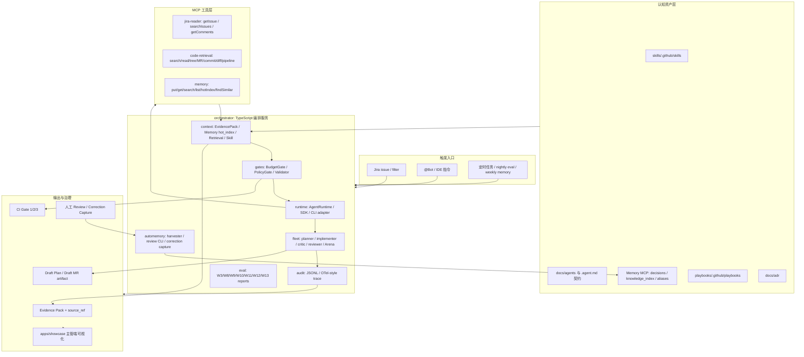

# Copilot-Harness 项目简介、架构设计、实施进展与效果

生成日期：2026-05-15
资料口径：Notion 总体方案与 Phase 0/1/2 规划页更新至 2026-05-14，Phase 3 规划页当前版本为 2026-05-08；本地仓库扫描时间为 2026-05-15。
仓库现状说明：当前工作树存在未提交改动，因此本文的“现状”同时参考已提交内容与工作区文件，不等价于某个干净 commit。

## 1. 项目简介

Copilot-Harness 是面向企业研发场景的 AI 开发中枢。它不是简单调用 Copilot 的脚本，而是一套部署在内网、以 TypeScript 编排服务为核心的组织级 harness：用 GitHub Copilot SDK / CLI 作为执行壳，用 Skill、Memory、MCP、Eval、AGENTS.md 和 ADR 作为认知资产，用 BudgetGate、PolicyGate、Validator、Audit 作为安全网。

项目的一句话定位：

> 以 Copilot SDK 承担 agent loop 和工具调用，以 OpenCode 沉淀的垂直资产作为认知脑，以自建 orchestrator 负责上下文装配、预算、策略、验证、审计和 Auto-Memory，让 AI 编程从“会回答”升级为“可控、可审计、可复利地交付”。

### 1.1 业务目标

- 从 Jira issue、GitLab 代码证据、Memory、Skill 中构造可追溯 Evidence Pack。
- 在单模型验证期固定 `gpt-5-mini`，通过 reasoning effort、预算闸和评测回归控制成本与行为稳定性。
- 逐步实现 Jira 到 Draft Plan，再到 Draft MR 的自动化闭环，但保留人工 review、人工 merge 和高风险域终审。
- 将人工 review comment、agent turn、成功/失败轨迹沉淀为 Auto-Memory、Skill 改进和 Eval 样本。
- 最终形成跨项目复用的 Skill / Memory / Playbook 资产，降低业务上下文冷启动成本。

### 1.2 当前定位

当前仓库已经从 Phase 0 骨架进入 Phase 2 控制面验证阶段。Phase 1 的 W8 最终验收指标已在本地证据中显示通过；Phase 2 的 W10/W11/W12/W13 多为本地、mock 或 contract 级闭环，生产侧 Runner、真实 `/fleet`、真实 MR 写回、真实 Memory cutover 仍未完成。

## 2. 完整架构设计

### 2.1 总体逻辑架构

### 2.2 仓库模块分层

| 模块                          | 当前职责                                                                                                                                 | 本地证据                                  |
| ----------------------------- | ---------------------------------------------------------------------------------------------------------------------------------------- | ----------------------------------------- |
| `orchestrator/`               | 核心 TypeScript 编排包，承载 runtime、gates、context、memory client、audit、automemory、fleet、eval、smoke、CI gate                      | `orchestrator/src/*`                      |
| `mcp-servers/jira-reader/`    | Jira 7.10.1 只读 MCP，暴露 `getIssue/searchIssues/getComments`，字段白名单、只读注解、错误映射                                           | `mcp-servers/jira-reader/src/tools.ts`    |
| `mcp-servers/code-retrieval/` | GitLab / local 代码检索 MCP，暴露代码搜索、文件读取、仓库树、MR、commit、diff、pipeline 等只读工具                                       | `mcp-servers/code-retrieval/src/tools.ts` |
| `mcp-servers/memory/`         | 跨 agent Memory MCP，支持 portable record、producer_agent、version、hot_index、冲突检测与红线扫描                                        | `mcp-servers/memory/src/*`                |
| `skills/`                     | 业务与工程 Skill 资产，包括 `jira-requirement-analysis`、`angular-delivery`、`angular17-upgrade-regression-handler`、`blood-transfusion` | `skills/.github/skills/*`                 |
| `playbooks/`                  | Playbook 资产占位，目前仍是 Phase 3 入口准备状态                                                                                         | `playbooks/.github/playbooks/README.md`   |
| `apps/showcase/`              | Vue 3 + Vite 主管端展示，消费 generated snapshot，展示 Jira、Skill、Agent、Evidence、Gate、Fleet/Arena 信号                              | `apps/showcase/src/App.vue`               |
| `docs/`                       | ADR、阶段收口、契约、验收与 readiness 证据                                                                                               | `docs/adr/*`、`docs/phase-*`              |

### 2.3 Runtime 设计

`AgentRuntime` 是隔离 Copilot SDK Preview 变动的核心抽象。本地接口已包含：

- `run(task)`
- `spawn(count)`
- `onTurnEnd(hook)`
- `onToolCall(hook)`
- `resumeSession(sessionId)`

当前 `RuntimeModel` 仍严格锁定为 `gpt-5-mini`，`RunOptions` 仅允许调节 `reasoningEffort` 与 `verbosity`。`spawn` 与 `resumeSession` 的真实能力在 SDK / CLI 当前状态下以结构化 unsupported capability 记录，不静默吞掉。

### 2.4 Gate 设计

Gate 链路按“预算先行、策略约束、结构验证、审计落盘”的顺序设计：

| Gate       | 职责                                                                                  | 当前落地                                                                     |
| ---------- | ------------------------------------------------------------------------------------- | ---------------------------------------------------------------------------- |
| BudgetGate | 限制 fanout、tool calls、input/output tokens、premium requests；超限转 partial result | W9 budget pressure deterministic pass，5/5 forced overrun 正确转 `blocked`   |
| PolicyGate | 默认拒绝未声明工具；只读工具 allowlist；高风险域 escalate                             | `getIssue/searchIssues/getComments/searchCode/readFile/...` 等只读工具白名单 |
| Validator  | 校验 `turn_state` 五态、Evidence Pack、source_ref 等结构                              | 已在 runtime/gates/context 测试链路中覆盖                                    |
| Audit      | 记录 turn、tool call、gate、review、correction、fleet 等结构化事件                    | JSONL reports 与 W11/W12/W13 报告引用                                        |

### 2.5 Evidence 与 Context 设计

Evidence Pack 是项目中的最小通货：

- `task_id`
- `intent`
- `evidences[]: source_ref + content + tool`
- `assumptions[]`
- `confidence`

Context Assembler 的注入顺序已演进为 Jira 事实、Memory hot_index、GitLab/code retrieval evidence、Skill hint，并带 token / bytes 预算。W8 之后，Jira + GitLab 联合分析样本要求真实 `jira:` 与 `gitlab:` source_ref，未命中代码证据时必须返回 `need_more_context` 或 `ask_human`，不得编造模块结论。

### 2.6 MCP 工具设计

| MCP            | 工具                                                                                                           | 关键约束                                                                                                                  |
| -------------- | -------------------------------------------------------------------------------------------------------------- | ------------------------------------------------------------------------------------------------------------------------- |
| Jira Reader    | `getIssue`、`searchIssues`、`getComments`                                                                      | 只读，JQL 上限，issue key schema，MCP error 不 crash                                                                      |
| Code Retrieval | `searchCode`、`readFile`、`listRepositoryTree`、`listMergeRequests`、`listCommits`、`getDiff`、`listPipelines` | GitLab 优先、本地 fallback、稳定 source_ref、排除 `.memory/reports/secrets/dist/node_modules` 等目录、输出前 redline scan |
| Memory         | `put/get/search/list/hotIndex/findSimilar` 等                                                                  | SQLite 本地存储、WAL、producer_agent 不可变、expected_version 乐观锁、portable record 兼容                                |

### 2.7 Auto-Memory 与 Review CLI

Auto-Memory 的设计目标是把隐性知识从 agent turn 中抽取为候选，而不是直接写入长期记忆：

1. Harvester 从 turn 结果中抽取候选。
2. 频率闸按 confidence、novelty、红线、source_ref 过滤。
3. Pending 文件进入 `.memory/pending/`。
4. Review CLI 人工执行 accept / reject / edit / skip。
5. accept / edit 后写入 Memory MCP，并归档、审计。
6. W9 以后加入冲突检测与 hot_index 分层加载。

W11 又补充了 Correction Capture：从 GitLab MR review discussion 中提取“修正模式”，生成 `correction` pending 候选，为 Skill / Memory 进化提供反馈入口。

### 2.8 多 Agent、Fleet 与 Arena

Phase 2 的多 agent 设计包含 planner、implementer、critic、reviewer 四类角色：

- planner 只读 evidence，拆成 3-7 个原子步骤。
- implementer 只允许触碰 `step.files_touched`。
- critic 做匿名候选盲评，不看 producer identity。
- reviewer 产出 Draft MR artifact，但不 push、不创建真实 MR。

W10 已证明 mock control-plane；W12 已补 Arena mock baseline：3-5 个匿名候选、四维评分、hard gate、双跑一致性、SQLite archive、winner/loser eval seed 产出。真实 `/fleet`、真实 worktree、真实 push/MR 仍禁用。

### 2.9 Showcase 前端

`apps/showcase` 是 Vue 3 + Vite + Ant Design Vue + ECharts + Three.js 的主管端展示层。它读取 `apps/showcase/src/generated/snapshot.json`，呈现 Jira 事项、Skill 分配、Agent 状态、MR 证据、Gate 健康、Fleet/Arena 审计等信息。当前 snapshot 包含 50 样本、36 条 task 级数据、W10/W12 相关字段，但 metadata 里仍有 `phase0Readiness: NOT_READY` 旧信号，需要后续刷新以对齐 W8 readiness 的最新 PASS 口径。

## 3. 落地实施进展

### 3.1 按 Notion 路线对照

| 阶段            | Notion 规划目标                                                                     | 本地现状                                                                                                                                                  | 状态判断                         |
| --------------- | ----------------------------------------------------------------------------------- | --------------------------------------------------------------------------------------------------------------------------------------------------------- | -------------------------------- |
| Phase 0 W0-W3   | 单仓骨架、Runtime/MCP 最小闭环、Gate/Validator、20 样本基线、审计链路               | 单仓、orchestrator、Jira Reader MCP、runtime/gate/context/memory/audit 骨架与阶段文档已存在                                                               | 已完成并作为基线                 |
| Phase 1a W5-W6  | 三个工程 Skill、Memory MCP、Evidence Pack v1、50 样本 Eval、前端证据面板            | `angular-delivery`、`angular17-upgrade-regression-handler`、`blood-transfusion`、`jira-requirement-analysis` 已在 skills；Memory/Evidence contract 已落地 | 已完成主要工程契约               |
| Phase 1b W7-W8  | Auto-Memory Harvester、Review CLI、Code Retrieval MCP、Jira+GitLab 联合 Eval        | W8 final target 通过：50/50 样本、50/20 联合样本、source_ref coverage 100%、Repo Hit@1 100%、Review CLI 0.76 min                                          | 已通过 W8 最终验收               |
| Phase 1c W9     | Memory 冲突检测、hot_index、AgentRuntime 定型、BudgetGate 压测、单模型 release gate | 冲突检测、hot_index、runtime unsupported capability、BudgetGate forced overrun 已有证据；默认模型仍锁 `gpt-5-mini`                                        | 技术加固完成，模型放宽未批准     |
| Phase 2 W10-W13 | 多 agent、CI 三闸、Correction Capture、Arena、跨 agent Memory                       | W10/W12 mock control-plane pass；W11 local/API pass 但 live CI 被 Runner 阻塞；W13 portable contract 与 mock drift report 已有                            | 部分完成，生产侧闭环未完成       |
| Phase 3 W14-W18 | Resolver v1、Jira 到 Draft MR、Playbook、Dream/Reflection、Runner                   | 仅有 playbook 占位和 Notion 规划；真实 Runner、Resolver、Dream 尚未落地                                                                                   | 未开始 / 待 Phase 2 外部阻塞解除 |

### 3.2 关键指标与效果

| 维度                   | 当前结果                                                                       | 证据                                                |
| ---------------------- | ------------------------------------------------------------------------------ | --------------------------------------------------- |
| W8 联合分析            | `sample_count=50/50`，`real_joint_sample_count=50/20`                          | `orchestrator/eval/w8-report.md`                    |
| 代码仓命中             | `repo_hit_at_1=100% (50/50)`                                                   | `orchestrator/eval/w8-report.md`                    |
| source_ref 覆盖        | `source_ref_coverage=100% (50/50)`                                             | `orchestrator/eval/w8-report.md`                    |
| Review CLI 效率        | `accept_rate=100% (7/7)`，`review_time_minutes=0.76`                           | `orchestrator/eval/w8-report.md`                    |
| W9 BudgetGate          | forced overrun `5/5 passed`，超限转 partial result                             | `docs/phase-1c-w9-closure.md`                       |
| W10 Fleet 控制面       | mock pass，3 candidates，selected candidate，真实 fanout/MR disabled           | `docs/phase-2-w10-closure.md`                       |
| W11 CI 三闸            | 本地 `ci:gate1/2/3` pass；Gate2 mock regression pass；Gate3 policy 0 violation | `docs/phase-2-w11-closure.md`                       |
| W11 Correction Capture | fixture 与 live GitLab API correction capture 均可生成 pending                 | `docs/phase-2-w11-closure.md`                       |
| W12 Arena              | mock baseline pass，llm_shadow recording-only，>=20 pending eval seed          | `orchestrator/eval/w12-arena-closure.md`            |
| W13 Memory drift       | mock drift `0`，但 `cutover_ready=false`                                       | `orchestrator/eval/w13-memory-drift-report.mock.md` |

### 3.3 主要工程成果

- 单仓工程形态稳定：root pnpm workspace 覆盖 `apps/*`、`orchestrator`、`mcp-servers/*`。
- Runtime 抽象具备单模型锁定、reasoning effort、一致 audit 字段和 unsupported capability 显式降级。
- Jira、Code Retrieval、Memory 三类 MCP 已形成只读证据与本地 Memory 写入能力。
- Auto-Memory 从“候选生成”到“人工审批写入”闭环已经具备 CLI 与审计链路。
- CI Gate 1/2/3 具备本地执行脚本与 GitLab MR pipeline 定义。
- Vue showcase 已能承接 snapshot，展示工程数据和治理信号。
- ADR 已记录单仓、runtime/MCP ownership、Phase 1c 单模型 release gate 等关键架构决策。

## 4. 当前效果总结

### 4.1 已经产生的效果

- 需求理解不再只依赖 prompt：W8 已把 Jira 与 GitLab evidence 绑定，50 个样本具备可追溯 source_ref。
- 质量门从口头约束变成可运行命令：`ci:gate1/2/3`、`eval:w8`、`w10:fleet-smoke`、`automemory-review`、`policy-check` 都有脚本入口。
- 知识复利路径成型：Harvester、Review CLI、Correction Capture、Memory MCP、hot_index 已把“人类修正”和“agent 经验”转成可审批资产。
- 安全边界清晰：真实 `/fleet`、真实 MR 创建、Jira 写回、多模型放行都未被提前打开；当前只是 control-plane 或 mock proof。
- 管理可视化开始具备基础：showcase 将 audit、tasks、MCP、evidence、route chain、Jira issue 等收敛到 snapshot。

### 4.2 仍未形成的生产效果

- GitLab Runner 不可用导致 W11 live CI job 仍 pending/created，无法完成“真实 MR pipeline 三闸执行”的最终闭环。
- 真实 `/fleet` worktree、真实代码 push、真实 GitLab MR 创建均仍是 NO-GO。
- W13 只有 mock drift report，尚无连续 2 天 dual-write 漂移为 0 的真实 cutover 证据。
- Phase 3 的 Resolver v1、Jira 到 Draft MR、Playbook 三件套、Dream/Reflection 仍处规划阶段。
- ADR 0003 的证据口径早于 2026-05-14 的 W8 final PASS，需要后续新 ADR 或修订说明来统一“W8 已 ready”和“仍不放宽模型”的治理结论。
- Showcase snapshot 的 readiness metadata 仍显示旧状态，需要重新生成并校验。

## 5. 建议下一步

1. 先补 GitLab Runner：让 W11 已创建的 MR pipeline 真正跑完 gate1/gate2/gate3/correction-capture。
2. 补 W13 真实 dual-write：连续 2 天记录 `drift_count=0`，并验证 OpenCode 写入能被 Copilot SDK/CLI 读取。
3. 统一 W9/ADR 口径：基于 W8 final PASS 新增一份 release gate review，明确是否仍保持单模型、为什么不放开真实 fanout。
4. 刷新 showcase snapshot：消除 `phase0Readiness: NOT_READY` 与 W8 readiness PASS 的展示不一致。
5. 在前四项完成前，不进入 Phase 3 的真实 Jira 到 Draft MR 写回；可以先实现 Resolver v1 的只读/fixture 路径。

## 6. 资料来源

### Notion 规划来源

- [Copilot 自动化编程工作流方案（含 Auto-Memory 候选回路）](https://www.notion.so/5dea20987ae782f69580817ce76dc29b)
- [从零搭建详细计划（gpt-5-mini 单模型验证期 · 18 周路线）](https://www.notion.so/fb6a20987ae782c6b60801b605f128be)
- [Phase 0 — 前置准备 + Harness 骨架（W0-W3）](https://www.notion.so/f29a20987ae78267849e815ef5dc1cfe)
- [Phase 1 — Skill 化 + Auto-Memory + 验证期加固（W5-W9）](https://www.notion.so/079a20987ae7838bb7a401abbbe0c4da)
- [Phase 2 — 多 Agent 协作 + 写回 + 跨 Agent Memory（W10-W13）](https://www.notion.so/c9ea20987ae7832fa2fa01e2599533fc)
- [Phase 3 — 业务需求自动化 + Dream 回路 + Playbook（W14-W18）](https://www.notion.so/a92a20987ae783009b3781d9f980e885)
- [AI 开发中枢月报 Vol.02 — Copilot-Harness 是什么](https://www.notion.so/8b1a20987ae78357a31e01ed52f5fdce)

### 本地仓库证据

- `README.md`
- `package.json`
- `pnpm-workspace.yaml`
- `orchestrator/src/runtime/types.ts`
- `orchestrator/src/gates/index.ts`
- `orchestrator/src/context/index.ts`
- `orchestrator/src/memory/index.ts`
- `mcp-servers/jira-reader/src/tools.ts`
- `mcp-servers/code-retrieval/src/tools.ts`
- `mcp-servers/memory/src/types.ts`
- `apps/showcase/src/App.vue`
- `apps/showcase/src/generated/snapshot.json`
- `docs/adr/0001-w1-monorepo.md`
- `docs/adr/0002-w2a-runtime-and-mcp-ownership.md`
- `docs/adr/0003-phase-1c-single-model-release-gate.md`
- `docs/phase-1b-w8-code-retrieval-contract.md`
- `docs/phase-1b-w8-review-cli-contract.md`
- `docs/phase-1c-w9-readiness.md`
- `docs/phase-1c-w9-closure.md`
- `docs/phase-2-w10-closure.md`
- `docs/phase-2-w11-closure.md`
- `docs/phase-2-w13-memory-portable-contract.md`
- `orchestrator/eval/w8-report.md`
- `orchestrator/eval/w12-arena-closure.md`
- `orchestrator/eval/w13-memory-drift-report.mock.md`
